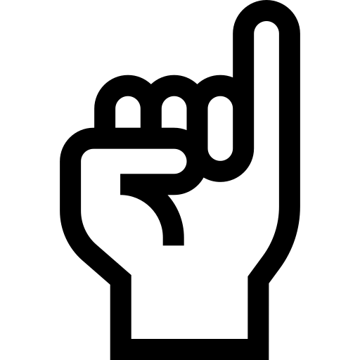
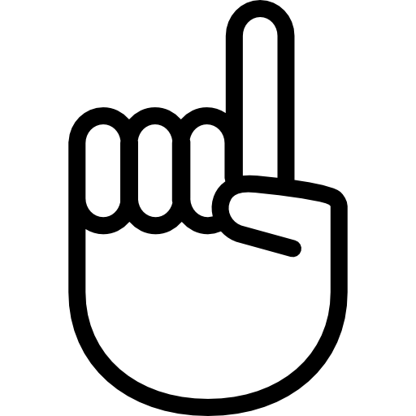
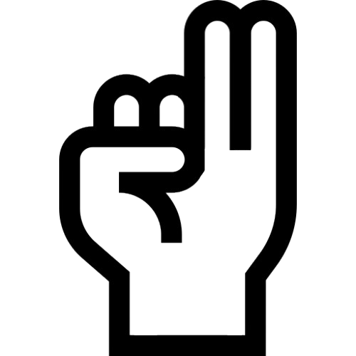

# Reconhecimento de Gestos com as Mãos

Este projeto utiliza **Python 3.10**, **MediaPipe** e **OpenCV** para detectar gestos com as mãos via webcam e executar ações no sistema, como abrir aplicativos ou encerrar o programa.

## 📌 Requisitos

- Python **3.10** (outras versões podem não ser compatíveis com o MediaPipe)
- Webcam
- Sistema operacional com suporte ao uso de `subprocess`

## 📦 Bibliotecas Utilizadas

- **mediapipe**
- **opencv-python**

### Instalação

```bash
pip install -r requirements.txt

```

## ✋ Funcionalidades

O sistema detecta gestos estáticos com as mãos e executa ações no computador conforme definido.

### Gestos Reconhecidos (versão atual)

| Gesto          | Condição do gesto                                                                 | Ação executada             |
|----------------|------------------------------------------------------------------------------------|----------------------------|
| `EXIT`         |                             | Fecha o aplicativo            |
| `OPEN_NOTEPAD` |             | Abrir o Bloco de Notas     |
| `OPEN_CALC`    |                   | Abrir a Calculadora        |
| `CLOSE_ALL`    |                   | Fecha todos os programas   |


## 🚀 Como utilizar

1. **Execute o script principal**:
   ```bash
   python main.py
   ```

2. **Posicione suas mãos diante da câmera de forma clara.**

3. **Faça um dos gestos definidos**

4. **A ação associada será executada automaticamente.**

## ⚙️ Configurações adicionais

- **Sensibilidade e estabilidade**: para evitar falsos positivos, os gestos só são reconhecidos após manutenção por `required_frames` consecutivos (ajustável na classe `GestureRecognizer`).
- **Filtro de proximidade**: os gestos são automaticamente ignorados quando as mãos ou dedos estiverem muito próximos ou cruzados.
